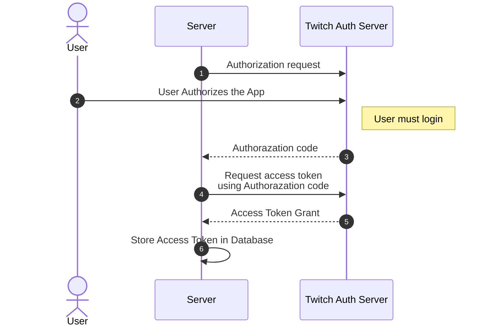

# auto-twitch-drops

## Twitch Authentication

## EventSub Webhook System

1. [Strategy Design Pattern](https://en.wikipedia.org/wiki/Strategy_pattern)
2. [Factory Design Pattern](https://en.wikipedia.org/wiki/Factory_method_pattern)

### Notification Handler

1. [channel.update](https://dev.twitch.tv/docs/eventsub/eventsub-subscription-types/#channelupdate)
2. [channel.raid](https://dev.twitch.tv/docs/eventsub/eventsub-subscription-types/#channelraid)
3. [drop.entitlement.grant](https://dev.twitch.tv/docs/eventsub/eventsub-subscription-types/#dropentitlementgrant)
4. [stream.offline](https://dev.twitch.tv/docs/eventsub/eventsub-subscription-types/#streamoffline)

### Callback Verification Handler

1. [HMAC](https://en.wikipedia.org/wiki/HMAC)
2. [Responding to a Challange Request](https://dev.twitch.tv/docs/eventsub/handling-webhook-events/#responding-to-a-challenge-request)

### Revocation Handler

1. User Removed
2. Authorization Revoked
3. Notification Failures Exceeded
4. Version Removed
